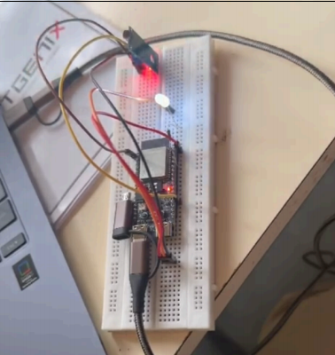

<h1 align="center">🚗 Automatic Headlight Control System</h1>

<p align="center">
ESP32-based intelligent headlight automation system using LDR sensor and ADC for ambient light detection.
</p>

<p align="center">
  
  <br> </br>
  
  <br> </br>
  
  <br> </br>
  
</p>

---

# 📌 Overview

An intelligent embedded system designed to automatically control vehicle headlights based on ambient light intensity using an LDR sensor and the built-in ADC of the ESP32 microcontroller.

The system eliminates manual intervention and improves:
- Road safety
- Energy efficiency
- Driver convenience

---

## ✨ Features

- Automatic headlight switching
- Ambient light detection
- ADC-based signal processing
- ESP32 microcontroller integration
- Real-time response
- Low-cost implementation
- Embedded automation system

---

## 🛠️ Technologies & Components Used

### Hardware
- ESP32 Development Board
- LDR Sensor
- LED (Headlight)
- 10kΩ Resistor
- 220Ω/330Ω Resistor
- Breadboard
- Jumper Wires

### Software
- Arduino IDE
- Embedded C/C++
- ADC Processing

---

## ⚙️ Working Principle

The LDR continuously senses ambient light intensity.

- In bright light:
  - LDR resistance decreases
  - ADC value remains below threshold
  - Headlight stays OFF

- In darkness:
  - LDR resistance increases
  - ADC value crosses threshold
  - Headlight turns ON automatically

The ESP32 processes ADC readings in real time and controls the LED output accordingly.

---

## 🏗️ System Architecture


---

## 🔌 Circuit Diagram

.png)

---

## 📸 Prototype Demo

### Hardware Prototype



### Working Video

[Watch Demo](demo/working-demo.mp4)

---

## 📂 Project Structure

```bash
automatic-headlight-control-system/
│
├── README.md
├── arduino-code/
├── circuit-diagram/
├── images/
├── docs/
├── demo/
└── components/
```

---

## 📚 Learning Outcomes

- Embedded systems programming
- ADC interfacing
- Sensor integration
- ESP32 development
- Real-time automation systems
- Hardware prototyping

---

## 🚀 Future Improvements

- Real vehicle integration
- Relay-based high-power switching
- Adaptive brightness control
- IoT monitoring support
- Smart city lighting integration

---

## 📄 Documentation

- Project Report
- PPT Presentation
- Working Demonstration
- Circuit Design
- Embedded Firmware

---

## 👨‍💻 Author

**Nandan Kuchabal**

- GitHub: https://github.com/Nandanvk137
- LinkedIn: https://linkedin.com/in/nandan-kuchabal-404964361

---

## 📝 Note

This repository documents an academic embedded systems project demonstrating automatic vehicle headlight control using ambient light sensing and ADC-based decision making.
